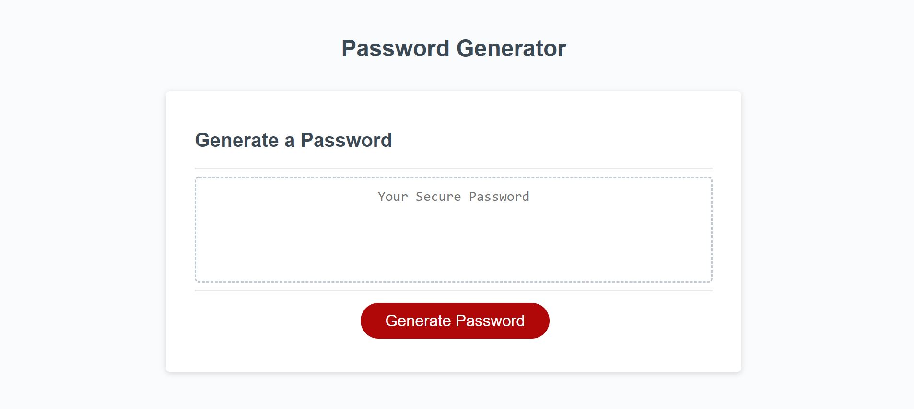
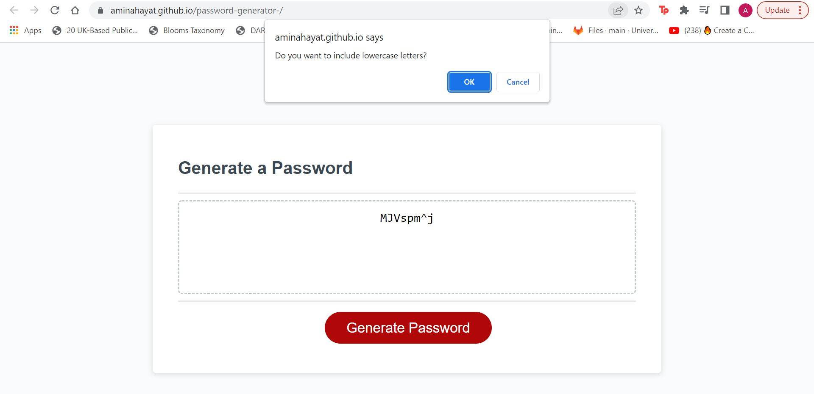

# Password-generator-

whilst the HTML and CSS was given, the task was to use javascript to create a password generator that incorporates between 8 to 126 characters which include numerical, alphabetical and special characters. I implemented features we learnt in the previous work in order to create a successful password generator that (hopefully) meets the criteria.

# Technologies Used
* HTML
* CSS
* JavaScript

# Application Screenshots

# Deployed URL
Deployed URL - https://aminahayat.github.io/password-generator-/

# Github Repository Link 
https://github.com/aminahayat/password-generator-/tree/main